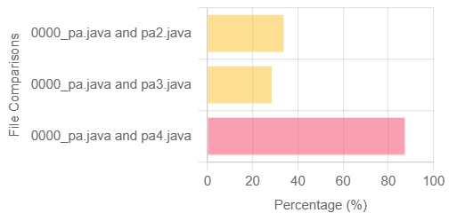
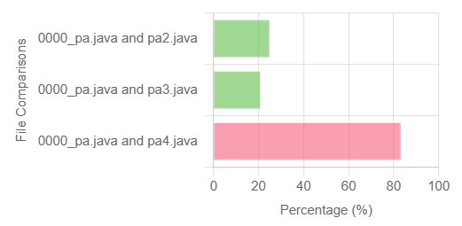
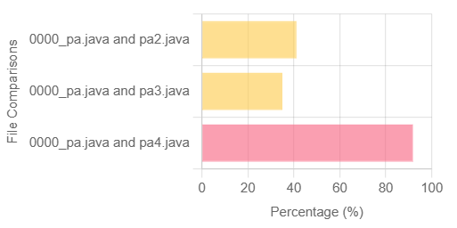

### PlagiarismTool for Java files

To run this project, ensure Java Development Kit (JDK) or OpenJDK is installed 

**To Run Using CMD Line**


### Standard Winnowing

To run, execute the following commands in the root folder (PlagiarismTool/):

1. Compile Java source files:

```bash
javac src/PlagiarismTool.java 
```

2. Run application:

```bash
java -cp . src.PlagiarismTool test
```


### ANTLR

To run, execute the following commands in the root folder (PlagiarismTool/):

1. Compile grammar file using:
```bash
java -jar lib/antlr-4.13.2-complete.jar srcANTLR/PlagiarismTool.g4
```

2. Compile Java source files generated by ANTLR:

```bash
javac -cp "lib/antlr-4.13.2-complete.jar" -d bin srcANTLR/PlagiarismToolBaseListener.java srcANTLR/PlagiarismToolLexer.java srcANTLR/PlagiarismToolListener.java srcANTLR/PlagiarismToolParser.java srcANTLR/PlagiarismToolANTLR.java
```

3. Run Application:
 
Windows:

for processing 2 particular files in the test folder:

```bash
java -cp "bin;lib/antlr-4.13.2-complete.jar" PlagiarismToolANTLR test
```

for processing all files in the data folder:

```bash
java -cp "bin;lib/antlr-4.13.2-complete.jar" PlagiarismToolANTLR data
```

Linux:

for processing 2 particular files in the test folder:

```bash
java -cp "bin:lib/antlr-4.13.2-complete.jar" PlagiarismToolANTLR test
```

for processing all files in the data folder:

```bash
java -cp "bin:lib/antlr-4.13.2-complete.jar" PlagiarismToolANTLR data
```


### TREE-SITTER

for processing 2 particular files in the test folder:

```bash
node srcTreesitter/tree-sitter.js test
```

for processing all files in the data folder:

```bash
node srcTreesitter/tree-sitter.js data
```

---

**To Run Web Application (Windows)**

1. Clone repo

```bash
git clone https://github.com/SFU-CMPT-473-2024-FALL/PlagiarismTool.git
```

3. Navigate to Application

```bash
cd PlagiarismTool
```

3. Install Dependencies

```bash
npm install --force
```

4. Run server.js

```bash
node server.js
```

5. Navigate to [localhost:3000](http://localhost:3000)


### Output: 

#### ANTLR Output


#### Base Output


#### Tree Sitter Output


### Debug:

Note: If graph fails to load, try testing two files at a time.

